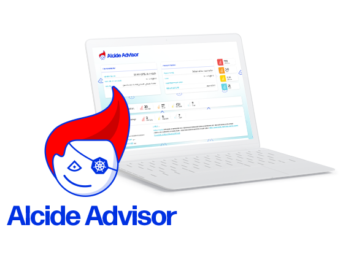
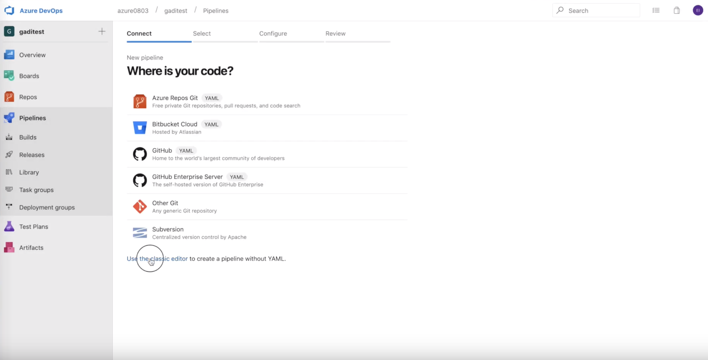
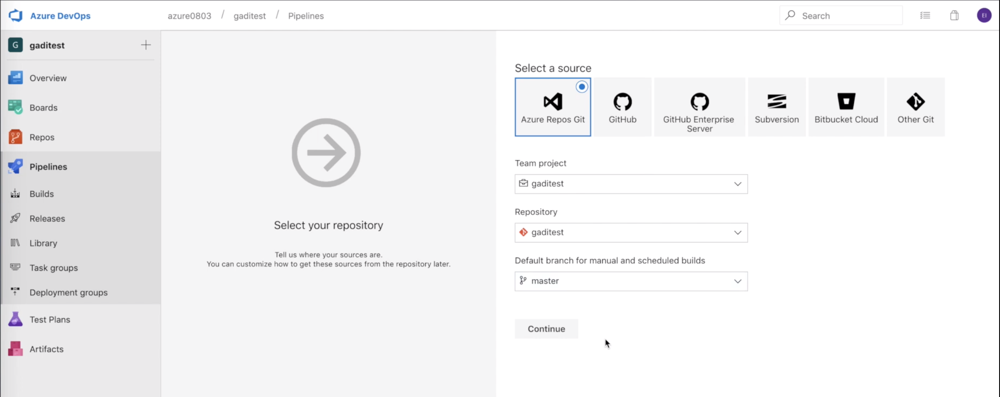
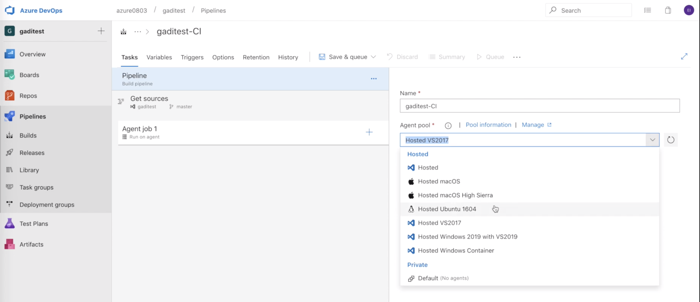
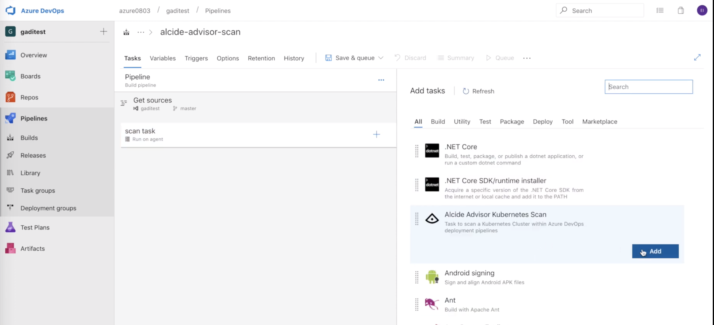
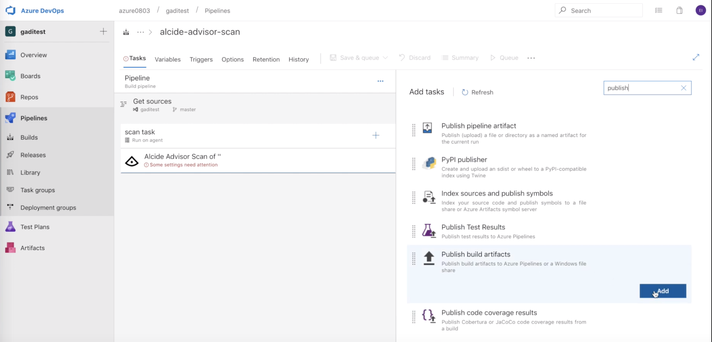
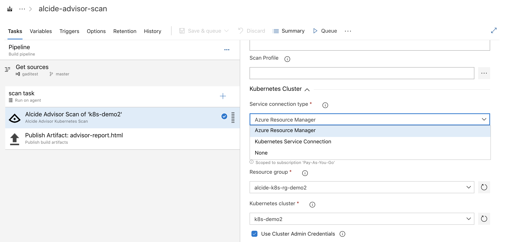
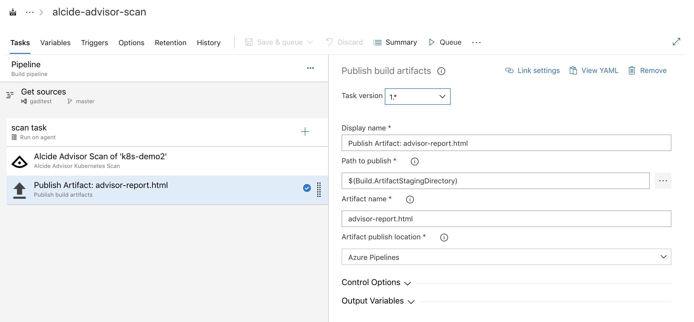
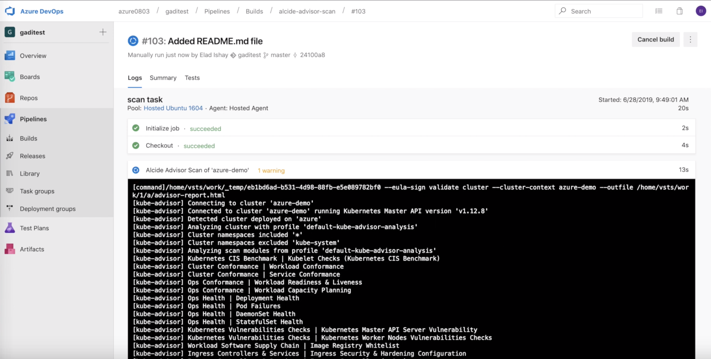
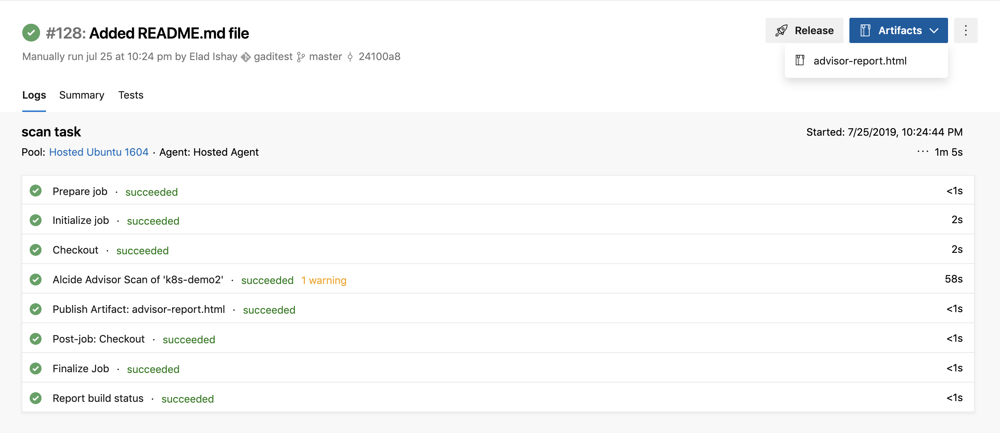

author:            Gadi Naor
summary:           Alcide Kubernetes Advisor | Azure DevOps
id:                00002
categories:        kubernetes,security,advisor
environments:      kubernetes
status:            draft
feedback link:     https://github.com/alcideio/pipeline
analytics account: 0

# Alcide Kubernetes Advisor Overview

## Welcome
Duration: 1:00

In this tutorial we will learn about **Alcide Kubernetes Advisor**, and how we can integrate it with Azure DevOps to implement continous security and cluster hygiene for one or more Kubernetes clusters.

Alcide Advisor is an agentless Kubernetes audit, compliance and hygiene scanner that’s built to ensure a friciton free DevSecOps workflows. Alcide Advisor can be plugged early in the development process and before moving to production.

#### With Alcide Advisor, the security checks you can cover includes:

- Kubernetes infrastructure vulnerability scanning.
- Hunting misplaced secrets, or excessive priviliges for secret access.
- Workload hardening from Pod Security to network policies.
- Istio security configuration and best practices.
- Ingress Controllers for security best practices.
- Kubernetes API server access privileges.
- Kubernetes operators security best practices.
- Deployment conformance to labeling, annotating, resource limits and much more ...

## Prerequisites

* [Azure DevOps account](https://azure.microsoft.com/en-in/services/devops/)
* [Azure AKS](https://azure.microsoft.com/en-in/services/kubernetes-service/) cluster running as part of your *Azure Subscription*

## Prepare Your Environment
Duration: 01:00

* [Install Alcide Kubernetes Advisor Task](https://marketplace.visualstudio.com/items?itemName=Alcide.alcide-kubernetes-advisor-ce).

## Create a Scan Pipeline
Duration: 03:00

We are going to create an Azure Pipeline that runs a security scan of an AKS cluster with the buitin scan profile.

### Create a build pipeline
Duration: 03:00

* Select **Pipelines** in the left menu
* Select a Git repository - in this tutorial  we will use the *Classic Editor* - see image 

* Select your Git Repo - in this tutorial we chose Azure DevOps Git repo.

## Configure Pipeline Host Environment
Duration: 01:00

Alcide Kubernetes Advisor tasks require linux based running environment and therefore we will select **Ubuntu 1604** in the drop list

## Add Pipeline Tasks

#### Add **Alcide Kubernetes Advisor** Task to our pipeline 

#### Add **Publish Build Artifacts** Task to our pipeline 

## Configure **Alcide Kubernetes Advisor Task**

* Select **Azure Resource Manager** in the drop down list **Service connection type**
* Select the *Subscription* with your *AKS* Kubernetes cluster you'd like to scan
* Select the **Resource group** where your target cluster runs 
* Select your **AKS Cluster**

#### Configure **Publish Build Artifacts** Task

* For *Path to publish* use **$(Build.ArtifactStagingDirectory)** 
* For *Artifact Name* use advisor-report

## Running The Pipeline

#### Run the pipeline by clicking the **Save & Queue** button

To run the pipeline, simply click the *Save & Queue* button on the menu.

At this point a build host will spin up and run our pipeline tasks.

## Review the scan report in your pipeline artifact

* Click on the *Artifcats* button in the upper right corner
* Navigate through the menu to download the generated scan report

