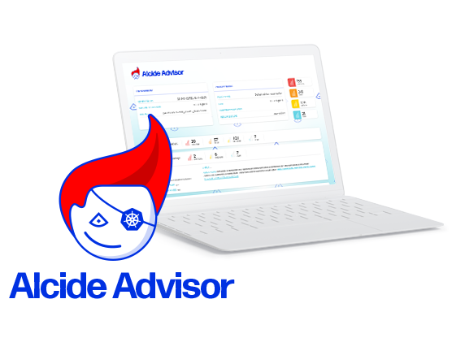

author:            Gadi Naor
summary:           Alcide Kubernetes Advisor | Circle CI
id:                00005
categories:        kubernetes,security,advisor,circleci
environments:      kubernetes
status:            public
feedback link:     https://github.com/alcideio/pipeline
analytics account: 0

# Alcide Kubernetes Advisor Overview

## Welcome
Duration: 1:00

In this tutorial we will learn about **Alcide Kubernetes Advisor**, and how we can integrate it with CircleCI to implement continous security and cluster hygiene for one or more Kubernetes clusters.




Alcide Advisor is an agentless Kubernetes audit, compliance and hygiene scanner that’s built to ensure a friciton free DevSecOps workflows. Alcide Advisor can be plugged early in the development process and before moving to production.

#### With Alcide Advisor, the security checks you can cover includes:

- Kubernetes infrastructure vulnerability scanning.
- Hunting misplaced secrets, or excessive priviliges for secret access.
- Workload hardening from Pod Security to network policies.
- Istio security configuration and best practices.
- Ingress Controllers for security best practices.
- Kubernetes API server access privileges.
- Kubernetes operators security best practices.
- Deployment conformance to labeling, annotating, resource limits and much more ...


## Prerequisites

* [CircleCI account](https://circleci.com/)
* [Google GKE](https://cloud.google.com/kubernetes-engine/) cluster running as part of your *GCP Project*


## Prepare Your Environment
Duration: 07:00

We will need to create a service account that allows us to pull GKE cluster credentials into the pipleline.

There is a nice [blog post](https://medium.com/uptime-99/making-sense-of-kubernetes-rbac-and-iam-roles-on-gke-914131b01922) that explains how GCP Kubernetes IAM roles maps to Kubernetes RBAC.

Negative
: For this tutorial we will use **roles/container.clusterAdmin** permissions.It grants us the ability to pull cluster adminsitration credentials into our *kubeconfig*. 


If you do not have such *service account* available already please follow instructions here: [GKE IAM Service Account](https://cloud.google.com/kubernetes-engine/docs/how-to/iam) to configure 


## Create a Scan Pipeline
Duration: 03:00

Alcide Kubernetes Advisor runs against a kubernetes cluster and requires access to kubeconfig to authenticate & authorize itself to the cluster.

If your pipeline can run kubectl commands against the cluster successfully - you should be ready to initiate a scan.


## Environment Variables Setup
Duration: 03:00

Under *Project Settings* --> *Build Settings* --> *Environment Variables*
Make sure you have:

* GCLOUD_SERVICE_KEY
* GOOGLE_PROJECT_ID
* GOOGLE_COMPUTE_ZONE

Positive
: To run against GKE, make sure the variable **GCLOUD_SERVICE_KEY** contains a GCP service account file with the Cluster Admin role.


## Creating our pipeline
Duration: 03:00

With CircleCI the pipeline trigger relies on a .circleci/config.yaml
and normally will fire a pipeline when changes are made to the hosting git repository.

Positive
: We are going to use CircleCI Orb which simplifies the pipeline integration. For the latest version see [https://circleci.com/orbs/registry/orb/alcideio/alcide-advisor](https://circleci.com/orbs/registry/orb/alcideio/alcide-advisor)


### Your .circleci/config.yaml

```yaml
version: 2.1
orbs:
  alcide: alcideio/alcide-advisor@1.0.3
  gcp-cli: circleci/gcp-cli@1.0.6
  gcr: circleci/gcp-gcr@0.0.2
  k8s: circleci/kubernetes@0.3.0  


jobs:
  deploy_and_scan_cluster:
    description: "Deploy resources into a cluster"  
    machine: true
    parameters:
      cluster:
        description: "The Kubernetes cluster name."
        type: string
    steps:
      - checkout
      #
      # make sure you have the following environment variables defined:
      # GCLOUD_SERVICE_KEY, GOOGLE_PROJECT_ID, GOOGLE_COMPUTE_ZONE
      #
      - gcr/gcr-auth
      - gcp-cli/install
      - k8s/install
      - run: |
          gcloud container clusters get-credentials <<parameters.cluster>>
      - run: |
          echo "Deploy resources into the cluster"
          kubectl get pods --all-namespaces  
      - alcide/alcide_advisor_scan:
          #cluster_context: 'myclustercontext'
          report_format: 'html'
          fail_on_critical: false
          alcide_apiserver: ''
          policy_profile: ''                      

workflows:
  advisor_scan:
    jobs:
      - deploy_and_scan_cluster:
          cluster: demo-cluster
```

## Running The Pipeline
Duration: 2:00

Positive
: Triggering the pipeline workflow is done by commiting changes into the Git repository.

### Review the scan report in your pipeline artifact

The pipeline will publish the scan results into your *Pipeline Artifacts* under the **advisor-report** directory


## Summary
Duration: 01:00

In this codelab we covered:

* GCP service account creation for *GKE* access
* Automate the scan of *GKE* clusters in a *CircleCI* pipeline 

Positive
: An overview & use cases of Alcide Kubernetes Advisor can be found in  <a href="/codelabs/advisor-codelab-01/index.html" class="btn btn-primary" role="button">here</a>

